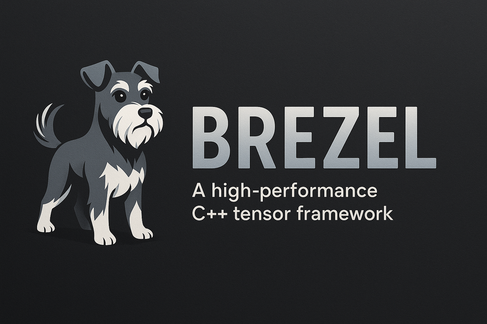

# Brezel: Modern C++20 Tensor Framework



## Overview

Brezel is a high-performance tensor computation library that combines the elegance of PyTorch's API with the performance benefits of modern C++20. Designed for researchers, engineers, and data scientists who need efficient tensor operations without sacrificing usability.

```cpp
auto a = bz::tensor::ones({2, 3});
auto b = bz::tensor::arange(6).reshape({2, 3});

// Perform operations
auto c = a * b + brezel::sin(b);

// Neural Network Operations
auto model = bz::nn::Sequential(
  bz::nn::Linear(784, 128),
  bz::nn::ReLU(),
  bz::nn::Linear(128, 10)
)

auto predictions = model->forward(input);
```

## Key Features

- **🚀 Performance-First**: Optimized core using SIMD, multi-threading, and GPU acceleration
- **🔧 Modern C++20**: Leveraging concepts, ranges, and other modern C++ features
- **🧠 Deep Learning Primitives**: Neural network building blocks with automatic differentiation
- **📊 Data Science Tools**: Statistical functions, data loading, and visualization utilities
- **📦 No Dependencies**: Core functionality has minimal external dependencies
- **🔌 Extensibility**: Easy to add custom operations and backends
